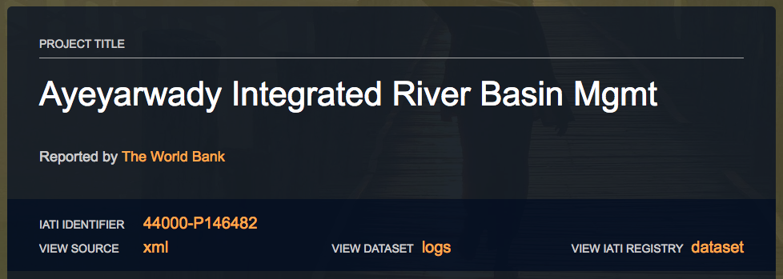

# IATI Sync - automatic import and update

## Overview

IATI - the [International Aid Transparency Initiative](http://iatistandard.org) - is an internationally-agreed standard for publishing and sharing data by many different aid actors, including donors. Some 900 organisations have begun publishing data on their aid activities to the IATI Standard. You may be able to use your organisation's IATI data to automatically keep your activities' financial data up to date.

### Can I use IATI Sync?

The main precondition to using IATI Sync is whether or not your colleagues at headquarters are publishing timely data to IATI: data has to be re-published at least quarterly, less than one month in arrears, to use it in Mohinga. You can check these pages on the IATI Dashboard to see how your organisation is doing:

* [check how frequently each donor publishes](http://dashboard.iatistandard.org/timeliness.html) \(remember, it has to be monthly or quarterly\)
* [check how far in arrears the publication is](http://dashboard.iatistandard.org/timeliness_timelag.html) \(remember, it has to be monthly\)

If your donor is not listed or does not meet these criteria, you can't yet use IATI Sync. Get in touch with your headquarters to discuss their timeline for moving towards more frequent and up-to-date IATI publication, or contact the IATI Secretariat's helpdesk at: [support@iatistandard.org](mailto:support@iatistandard.org) for more information. In the meantime, you can [continue editing activities in the normal way](editing-an-activity.md).


### Limitations in Mohinga's IATI Sync

We have just begun rolling out this exciting new feature and we are hard at work in making further improvements. For now, however, IATI Sync has a few limitations:

* only **existing activities** can be synced: [new activities have to be added in the normal way](adding-an-activity.md), before syncing becomes possible.
* only **activities with a single implementing organisation** can be synced. This is in part due to the way that organisations are identified in IATI data - it can otherwise be hard to know how much money is going to which organisation when looking at the data.
* only **financial data can be imported**. We began with financial data as experience elsewhere with IATI import shows that the biggest gains are to be realised from reducing the burden of updating quarterly financial data for projects. IATI import also promises to \(in many cases\) significantly increase the quality and detail of financial data captured. Other types of information \(locations and documents\) are less likely to change on such a regular basis.

We're continuing to work hard to add new features and begin to make it possible to roll out this feature to other sorts of projects and other types of information in the near future.


## How do I use IATI Sync?

Once you're pretty sure you can use IATI Sync for an activity \(if you're not sure, take a look at [the previous section](iati-sync-automatic-import-and-update.md#can-i-use-iati-sync) and particularly the box just above!\), you can access this feature from the activity editor for that particular activity. If you're unsure how to access the activity editor, take a look at the guides on how to [Log in to Mohinga](log-in-to-mohinga.md), the [introduction to the Activity Manager](activity-manager.md), and [the Activity Editor itself](editing-an-activity.md).

### Getting started

From the **Activity Manager**, you can see which activities you have already enabled IATI Sync for, and which ones you can enable sync for. In the example below, you can see that the top two have IATI Sync enabled \(they are labelled `Published; IATI Sync`\) and the third activity has not yet had IATI Sync enabled \(it is labelled simply `Published`\). You can get to the activity editor - and begin or configure IATI Sync - by clicking on the title of the relevant activity.

From the **Activity Editor**, click on the Finances tab from the grey left-hand menu, and then IATI Sync, from the tabs beneath the "FINANCES" subheading. You should see something like this:

### Enter the IATI Identifier

To begin, click `Setup IATI Sync`. You'll see a pop-up box like this, asking you for the IATI Activity Identifier for this activity. The IATI Identifier is a slightly more elaborate version of the project code:

At this point, IATI Sync is basically asking you for the project code for this activity. However, it has to be coded in a way that makes it unique to your organisation. To begin with, this can make it a bit tricky to know how the IATI Identifier will differ from your own internal project code, but over time you'll start to see the pattern used by your particular organisation.

If you know the correct IATI Identifier, enter it in the text box and click `Search IATI`. Note that no data will be imported at this stage. If you don't know the IATI Identifier, read on.

#### How to find out the IATI Identifier

The easiest way to find out the IATI Identifier for a project is to take a look on D-Portal. This is a site built \(in part\) by the IATI Secretariat, which allows you to search through raw IATI data. It can be useful to take a look at the wealth of data that is available.

1. **See the list of the various donors in Myanmar** who have begun publishing to IATI ****[via this page on D-Portal](http://d-portal.org/ctrack.html?search&country=MM#view=donors). Remember, the total numbers might not be exactly what you would expect compared to OECD DAC data, as this is raw and timely data.
2. **Click on your donor**. In this example, we're going to select the World Bank.
3. **Scroll through to find the title of the activity that you want to sync, and click on the title**. If you have many activities, you can search through the browser window by using the quick keyboard shortcut CTRL+F \(if you're using a Mac, it's ⌘+F\), and then typing a few letters from the title of the activity.
4. You'll see the IATI Identifier in orange near the top of the page.

### Compare the activity reported locally versus IATI

After entering the IATI Identifier and clicking `Search IATI`, if there was a successful match, you'll see something like the following page, allowing you to verify at a glance that this is indeed the same activity.

If you are happy that it's the same activity, click the blue `Update` button. If not, click `Search again`. Note that no data will be imported at this stage. The page will reload and you will see a new screen.

### Choose which financial data to sync

On the IATI Sync tab, you'll see new information for the activity you just linked. Here, you can choose which financial data you would like to import, by toggling the switch in the Sync column. When it's toggled to green, IATI Sync will be enabled.

Generally, if the numbers look sensible to you, it's a good idea to toggle all of the different financial flows to Sync enabled - so green lights on every row. 


### Should I switch IATI Sync on or not?

You may not wish to enable IATI Sync if you know that the data that is already reported to Mohinga is more timely or reliable than that you can see published by your headquarters to IATI. For example, if you could see $1mn of budgets in Mohinga, and $0 in IATI, you will probably want to stick with the data already reported to Mohinga for now. In this case, you'll probably want to keep sync for _Budgets_ turned off, but you can still consider it for _Commitments, Outgoing Funds, and Incoming Funds_.

However, you should also consider that, going forward, IATI Sync has some big advantages over manual reporting:

* it normally contains much more detailed financial data \(providing a smoother or more accurate spend profile, and including historical data\);
* it allows for automatic updating of data, so it will likely make your reporting much more sustainable as time goes on. For example, if you are busy or if your successor in your position takes some time to get into post, activities already synced should continue to be automatically updated without additional work.


### Complete the import process

When you're happy with your choices about which financial flows to begin importing, click Save IATI Sync. You'll see the following pop-up, with a final confirmation that you're happy to proceed with import. Note that:

* this process will overwrite the existing financial data with new data from IATI;
* you won't be able to enter or edit financial data in Mohinga \(for the financial flows you've chosen to sync\);
* you can stop IATI Sync at any time, and then go back to editing the imported data locally. If you switch IATI sync back on, the current IATI data would then overwrite any local changes.

If you're ready to proceed, click `Agree and Sync from IATI`. The pop-up will disappear and you will begin to see status messages about the progress of the IATI Sync. When it's complete, the page will reload and you will see the results: the locally reported data and the IATI data will show the same results for those financial flows you've chosen to sync. You'll also see a log of how many financial transactions were imported.

That's it! For this activity, your financial data will be automatically updated from now on. Don't forget to continue updating Mohinga for other non-financial data, and also if you chose not to import particular financial flows.

