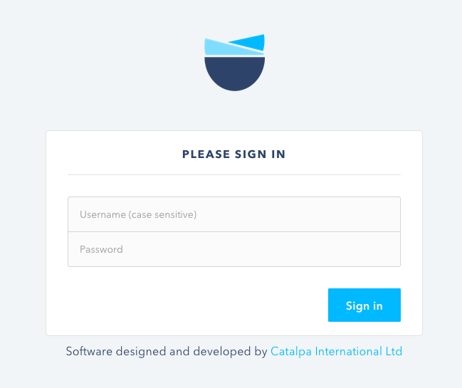

# Log in to Mohinga

## Go to the Mohinga website

Visit [https://mohinga.info](https://mohinga.info) and click the `LOGIN` button from the top right.

## Enter your login details

Enter your username and password into the form, using the credentials provided to you by FERD. If you do not yet have credentials, email FERD via: [ferd.mopf@gmail.com](mailto:ferd.mopf@gmail.com)

## Next steps after login

After login, you'll be redirected to your organisation's public page, where you can see a summary of your assistance to Myanmar.

### Edit organisation summary and contact details

At the top of the page, you will see summary information about your organisation, and contact details. You can edit any information by clicking the small `Edit` buttons next to the relevant section.

### Edit activities: Activity Manager

To review the data the activities you have reported to date to Mohinga, click on the `Activity Manager` link at the top left of the page. Read more about the [Activity Manager](activity-manager.md).

